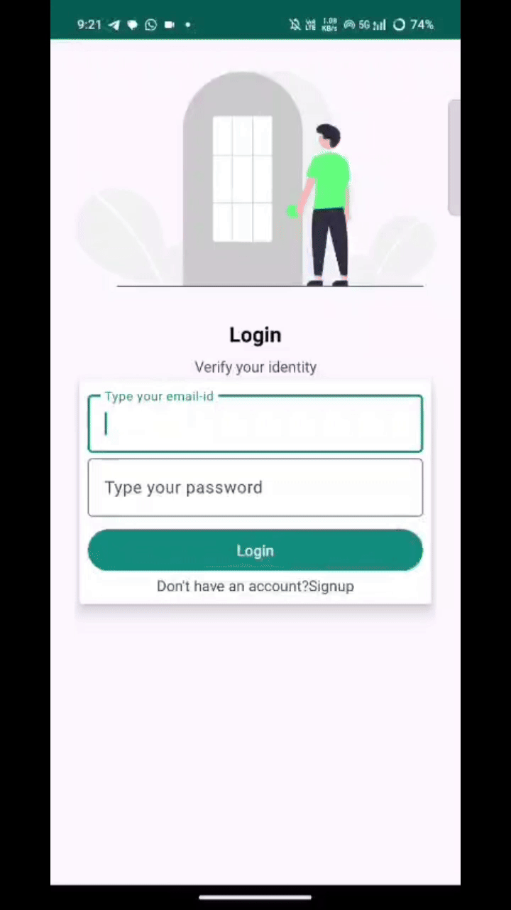
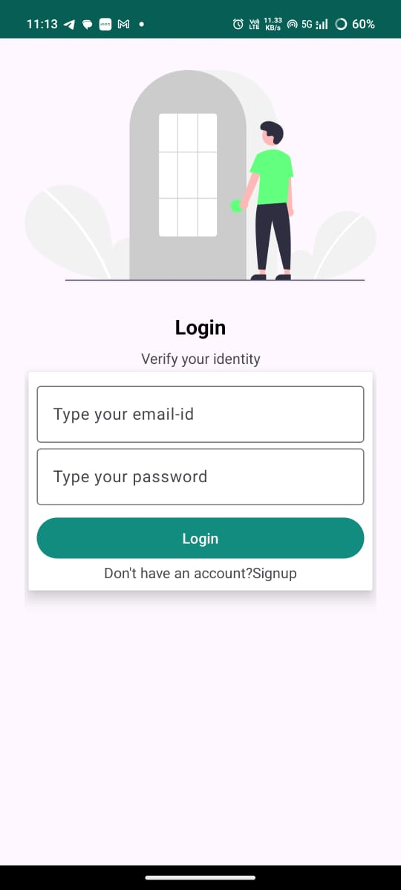
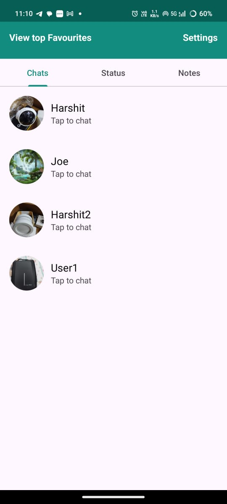
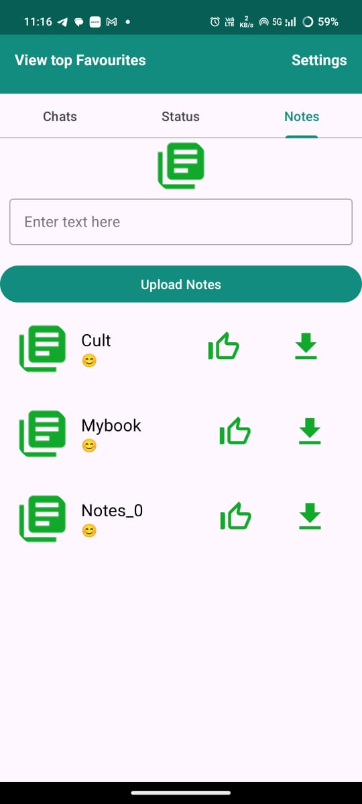
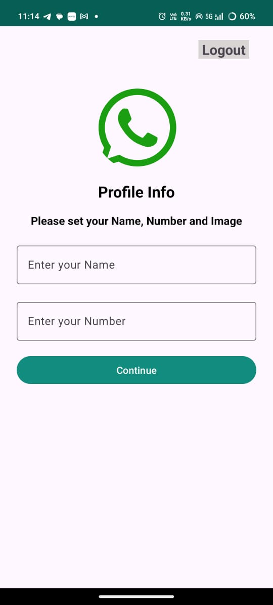
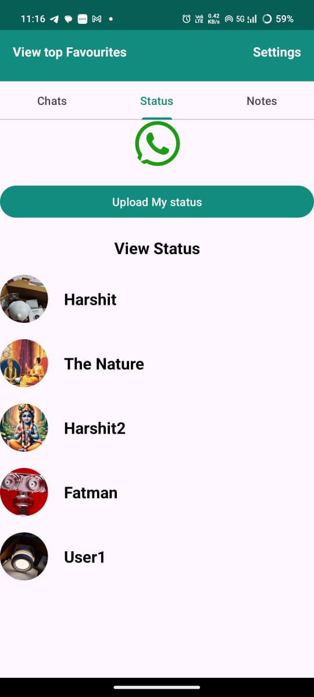
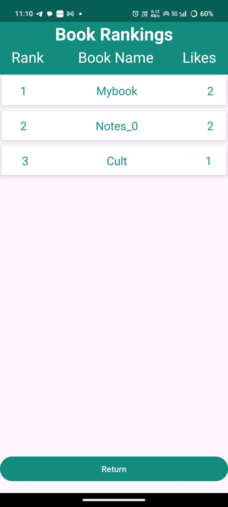

# 📚 Convoswift – Android App

A **full-stack Android application** built to connect students on a common platform with a standard and engaging user experience.  
It enables **real-time chat, notes sharing, profile customization, upload and view status updates**, and a **book rankings page** to highlight the most useful study materials.

---

## 🎥 Demo

Here’s a quick demo of **Hisab Kitab** in action:

---

## 🚀 Features

- 🔐 **User Authentication** – Secure login & registration with personalized profiles  
- 💬 **Real-time Chat** – Instant messaging between students  
- 📂 **Notes Sharing** – Upload and access study notes with ease  
- 📊 **Book Rankings** – Notes are ranked based on likes  
- 🟢 **Upload and View Status Updates** – Share updates with peers in real-time  
- 🧑‍🎨 **Profile Customization** – Edit and personalize your student profile  

---

## 📸 Screenshots 

| Login Screen | Chat Screen | Notes Page |
|--------------|-------------|------------|
|  |  |  |

| Profile Screen | Status Feature | Book Rankings |
|----------------|----------------|---------------|
|  |  |  |

---

## 🛠️ Tech Stack

- **Frontend:** Kotlin
- **Backend:** Firebase (Authentication, Realtime Database, Storage)  
- **Database:** Firebase Realtime Database
- **UI Design:** XML-based UI with Material Design Components  

---
